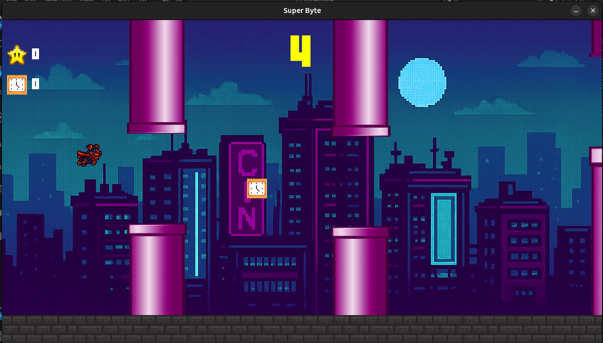

# SUPER BYTE

Um viciante endless runner 2D com mecânica 'flappy', desenvolvido em Python e Pygame. O objetivo é guiar o 'Super Cão' pelo maior percurso possível, evitando obstáculos com precisão. Colete itens estratégicos, comUm viciante endless runner 2D com mecânica 'flappy', desenvolvido em Python e Pygame. O objetivo é guiar o 'Super Cão' pelo maior percurso possível, evitando obstáculos com precisão. Colete itens estratégicos, como a Estrela da Invencibilidade e o Relógio do Doutor Estranho, para auxiliá-lo a alcançar um novo recorde



## Tecnologias Utilizadas

* **Linguagem:** Python 3
* **Biblioteca:** Pygame
* **Estrutura:** O jogo é modularizado, separando lógica de Personagem, Obstáculos, Coletáveis, Telas.

## Pré-requisitos

Para rodar este jogo, você precisará ter **Python 3** e **Pip** (gerenciador de pacotes do Python) instalados em sua máquina.

* [Download do Python (Windows)](https://www.python.org/downloads/windows/)
* No Linux (Ubuntu/Debian), você pode instalar com: `sudo apt install python3 python3-pip python3-venv`

## Como Rodar

Siga as instruções abaixo de acordo com o seu sistema operacional.

---

### Instruções para Windows

1.  **Clone o repositório:**
    Abra o **Command Prompt (CMD)** ou **PowerShell**.
    ```bash
    git clone https://github.com/HenriqueGouveia42/superbyte.git
    cd superbyte
    ```

2.  **Crie e ative um Ambiente Virtual (venv):**
    Ainda no CMD ou PowerShell, dentro da pasta:

    ```bash
    python -m venv venv
    
    .\venv\Scripts\activate.bat
    ```
    *(Se estiver no PowerShell, talvez precise usar: `.\venv\Scripts\Activate.ps1`)*

3.  **Instale as dependências:**
    Com o ambiente virtual ativado (você verá `(venv)` no início do prompt), rode:
    ```bash
    pip install -r requirements.txt
    ```

4.  **Rode o jogo:**
    ```bash
    python main.py
    ```

---

### Instruções para Linux (Ubuntu/Debian)

1.  **Clone o repositório:**
    Abra seu terminal.
    ```bash
    git clone [https://github.com/HenriqueGouveia42/superbyte.git](https://github.com/HenriqueGouveia42/superbyte.git)
    cd superbyte
    ```

2.  **Crie e ative um Ambiente Virtual (venv):**
    ```bash
    python3 -m venv venv
    source venv/bin/activate
    ```

3.  **Instale as dependências:**
    Com o ambiente virtual ativado (você verá `(venv)` no início do prompt), rode:
    ```bash
    pip install -r requirements.txt
    ```

4.  **Rode o jogo:**
    ```bash
    python3 main.py
    ```

---

## Solução de Problemas (Troubleshooting)

**No Windows (PowerShell):**
* Se você receber um erro sobre "scripts desabilitados" ao tentar ativar a venv no PowerShell (`.\venv\Scripts\Activate.ps1`), abra o PowerShell *como Administrador* e rode este comando. Depois, feche e tente novamente no terminal normal.
    ```powershell
    Set-ExecutionPolicy -ExecutionPolicy RemoteSigned -Scope CurrentUser
    ```

**No Linux:**
* Se o `pygame` falhar na instalação, você pode precisar de algumas dependências do sistema. Rode:
    ```bash
    sudo apt-get install -y python3-dev libsdl-image1.2-dev libsdl-mixer1.2-dev libsdl-ttf2.0-dev libsdl1.2-dev libsmpeg-dev python3-numpy subversion portaudio19-dev
    ```
    ...e tente o `pip install -r requirements.txt` novamente.

## Controles

* **[Espaço]:** [Pular]